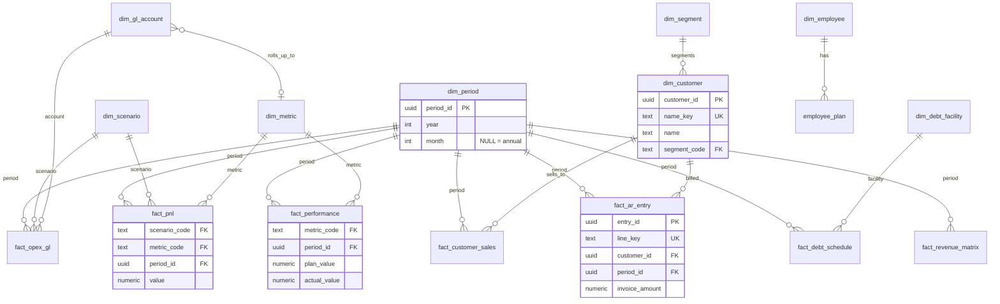

# Data Architecture — Southern Precision Partners

A single, explicit pipeline that data flows through in one direction:

```
   RAW            NORMALIZATION        CLEANED            PROPER ERD              ANALYTICS
(ingestion)   →   (typed/parsed)   →  (validated)   →  (normalized core)  →  (serving + pre-calc)
  raw.*             staging.*          staging.clean_*      core.*            analytics.*  +  serving.*
 immutable         rebuildable         rebuildable       source of truth      derived / mapping layer
```

Each layer is a Postgres **schema**, so the boundary is enforced by the database, not
convention. Data only ever moves *left → right*. Nothing downstream writes back upstream.

The **front end and every API route read from `serving.*` only** — never from `core`,
`staging`, or `raw`. That one rule is what lets us rearchitect the core ERD without
breaking the app: the serving views are a stable contract, and we re-point their
internals as the model evolves.

---

## 1. `raw` — files at ingestion (immutable)

Every source file lands here **exactly as received**, one table per source sheet/file,
all columns `text` (no parsing, no coercion), plus provenance. Append-only; we never
edit or delete raw rows — a re-ingest inserts a new `ingestion_id` batch.

- `raw.ingestion` — registry: `ingestion_id`, `source_file`, `sheet`, `loaded_at`,
  `row_count`, `sha256`, `loaded_by`. Every raw row carries its `ingestion_id`.
- `raw.mosaic_ar_2026`, `raw.mosaic_summary_26`, `raw.mosaic_plan`,
  `raw.mosaic_revenue_matrix_monthly`, `raw.mosaic_historical`, … — one per sheet in
  `Mosaic.xlsx`. Columns are `col_a … col_z text` + `ingestion_id` + `row_num`.

Why: reproducibility and audit. Any cleaned figure can be traced back to the exact file
and row it came from — essential for investor-facing numbers.

## 2. `staging` — normalization + cleaning (rebuildable)

Deterministic transforms from `raw`: parse dates/money, trim, de-duplicate, coerce
types, drop totals/blank rows, unify keys. Fully rebuildable — `truncate` and re-run any
time. Two sub-steps live here:

- **Normalization** (`staging.norm_*`): typed columns, one row per real record, source
  columns mapped to meaningful names. Still source-shaped.
- **Cleaning** (`staging.clean_*`): validated + conformed — business keys normalized
  (`name_key`), invalid rows quarantined into `staging.reject_*` with a reason, units
  standardized (all money in dollars). This is the last stop before the core ERD.

Nothing in `staging` is read by the app. It exists so the `core` load is a trivial,
auditable upsert from already-clean rows.

## 3. `core` — the Proper ERD (source of truth)

Normalized relational model. **One entity, one table, one primary key — no PK
duplication anywhere.** Facts reference dimensions by foreign key; a fact never repeats a
dimension's attributes. Kept deliberately small and boring.

### Dimensions

| Table | PK | Notes |
|---|---|---|
| `core.dim_period` | `period_id` | The single time spine. One row per (year, month); `month IS NULL` = annual. Every fact joins here — annual and monthly data share one dimension. |
| `core.dim_customer` | `customer_id` | Identity only. `name_key` unique. FK → `dim_segment`. **No lifetime aggregates** (those are derived → analytics). |
| `core.dim_segment` | `segment_code` | `b2b_tier1`, `b2b_tier2`, `b2b_tier3`, `individual_repeat`, `individual_single`. |
| `core.dim_employee` | `employee_id` | Identity only. |
| `core.dim_scenario` | `scenario_code` | `plan`, `forecast`, `actual`. |
| `core.dim_metric` | `metric_code` | `revenue`, `cogs`, `gm`, `opex`, `ebitda`, `fcf`, `cash_balance`, … `unit`, `is_percent`, `statement_section`. |
| `core.dim_gl_account` | `gl_account_id` | Chart of accounts for OpEx/GL. Optional FK → `dim_metric` (rollup). |
| `core.dim_debt_facility` | `facility_id` | SBA term loan, seller note, LOC. |
| `core.dim_contact` | `contact_id` | CRM prospects (distinct from customers). |

### Facts (grain in parentheses)

| Table | Grain / PK | Replaces |
|---|---|---|
| `core.fact_ar_entry` | one AR ledger line — `entry_id` PK, `line_key` unique | `ar_transactions` |
| `core.fact_customer_sales` | customer × period — PK `(customer_id, period_id)` | `customer_annual_sales` |
| `core.fact_pnl` | scenario × metric × period — PK `(scenario_code, metric_code, period_id)` | `forecast_pnl` (EAV) |
| `core.fact_opex_gl` | scenario × GL account × period — PK `(scenario_code, gl_account_id, period_id)` | `forecast_opex_gl` |
| `core.fact_debt_schedule` | facility × period — PK `(facility_id, period_id)` | `debt_schedule` |
| `core.fact_revenue_matrix` | period — PK `period_id` | `revenue_matrix` |
| `core.fact_performance` | metric × period(month) — PK `(metric_code, period_id)` | `monthly_performance` |

### Operational entities (workflow, not analytics)

| Table | PK | Notes |
|---|---|---|
| `core.employee_plan` | `plan_id` | unique `(employee_id, plan_scenario)`. `annualized_cost` is **derived** — computed in analytics, not stored here. |
| `core.growth_initiative` | `initiative_id` | `name` unique. |
| `core.delivery_task` | `task_id` | The Delivery Plan. |

### ERD



## 4. `analytics` — pre-calculated figures + the serving/mapping layer

Two purposes, cleanly split — exactly the two recall surfaces requested.

### 4a. `analytics.figure` — one flat pre-calc table for fast recall

Every derived number the platform displays, pre-computed and stored long, so any figure
is a single indexed lookup — no aggregation at request time.

```
analytics.figure (
  figure_id     uuid pk,
  scope         text,      -- 'company' | 'customer' | 'employee' | 'deal'
  entity_key    text,      -- name_key / employee_id / NULL for company-wide
  metric_code   text,      -- 'revenue','ebitda','lifetime_sales','annualized_cost','moic',...
  scenario_code text,      -- 'plan' | 'forecast' | 'actual' | NULL
  year          int,       -- NULL = all-time
  month         int,       -- NULL = annual / point-in-time
  value         numeric,
  unit          text,
  computed_at   timestamptz
)
unique (scope, entity_key, metric_code, scenario_code, year, month)
```

Refreshed by `analytics.refresh_figures()` (a function that recomputes from `core.*`).
Examples of what it holds: company Revenue/EBITDA plan by year; per-customer
`lifetime_sales`, `balance`, `last_sale_date`; per-employee `annualized_cost`; deal-level
MOIC/IRR. `customers.lifetime_sales` and `employee_plan.annualized_cost` — currently
stored *inside* the entity tables — move here, so the core stays normalized.

### 4b. `serving.*` — the front-end mapping layer (stable contract)

Denormalized **views** shaped to the app's forms and screens. The Next.js app and every
API route query these and nothing else. Because they're views, we can change the core ERD
underneath and only update the view body — the app's queries never change.

| View | Feeds | Composed from |
|---|---|---|
| `serving.customer_summary` | Customers CRM | `dim_customer` + `dim_segment` + `analytics.figure` |
| `serving.monthly_summary` | Summary tab | `fact_performance` + `dim_metric` + `dim_period` |
| `serving.hr_roster` | HR & Payroll | `dim_employee` + `employee_plan` + `analytics.figure` |
| `serving.delivery_plan` | Delivery Plan | `core.delivery_task` |
| `serving.forecast_pnl` | Forecast | `fact_pnl` + dims |
| `serving.opex_gl` | Forecast (GL) | `fact_opex_gl` + dims |
| `serving.debt_schedule` | Deal page | `fact_debt_schedule` + dims |
| `serving.revenue_matrix` | Forecast | `fact_revenue_matrix` + dims |
| `serving.company_kpi` | Home / Summary KPIs | `analytics.figure` (scope='company') |

Writes (editable tabs) still go through the API routes to the underlying `core` table
that owns the field — the serving views are read-only. After a write, the API triggers
`analytics.refresh_figures()` for the affected scope so caches stay consistent.

---

## Governance rules

1. **One direction.** `raw → staging → core → analytics/serving`. No backflow.
2. **No PK duplication in `core`.** Every entity has exactly one table and one key;
   facts reference dimensions by FK and never copy their attributes.
3. **`raw` is immutable.** Corrections happen by re-ingesting, never by editing raw rows.
4. **`staging` is disposable.** Always fully rebuildable from `raw`.
5. **No derived values in `core`.** Anything computed (lifetime totals, annualized cost,
   MOIC) lives in `analytics.figure`, never in a core entity table.
6. **App reads `serving.*` only.** The mapping layer is the app's entire data contract.
7. **Keep it simple.** Prefer fewer, well-named tables over clever ones. A new source of
   data adds `raw`/`staging` tables and an ETL step — it does not reshape `core`.

## Cutover plan (staged, non-breaking)

The migration that scaffolds this (`0012`) is **additive** — it creates the new schemas
alongside today's `public` tables and drops nothing. Cutover proceeds in reversible steps:

1. **Scaffold** — create `raw`/`staging`/`core`/`analytics`/`serving` + the `serving.*`
   views reading from *today's* `public` tables. App can migrate to `serving.*`
   immediately, fully decoupled, with zero data movement. *(migration 0012)*
2. **Backfill core** — load `core.*` from `public` via `staging`, reconcile row counts &
   totals against the `audit:financials` script. *(migration 0013 + ETL script)*
3. **Repoint serving** — swap each `serving.*` view's body to read from `core`/`analytics`
   instead of `public`. App queries are unchanged. *(migration 0014)*
4. **Retire** — once serving reads only from core and the audit passes, drop the old flat
   `public` tables. *(migration 0015)*

Each step is independently verifiable and revertible; the app keeps working throughout
because it only ever sees `serving.*`.
